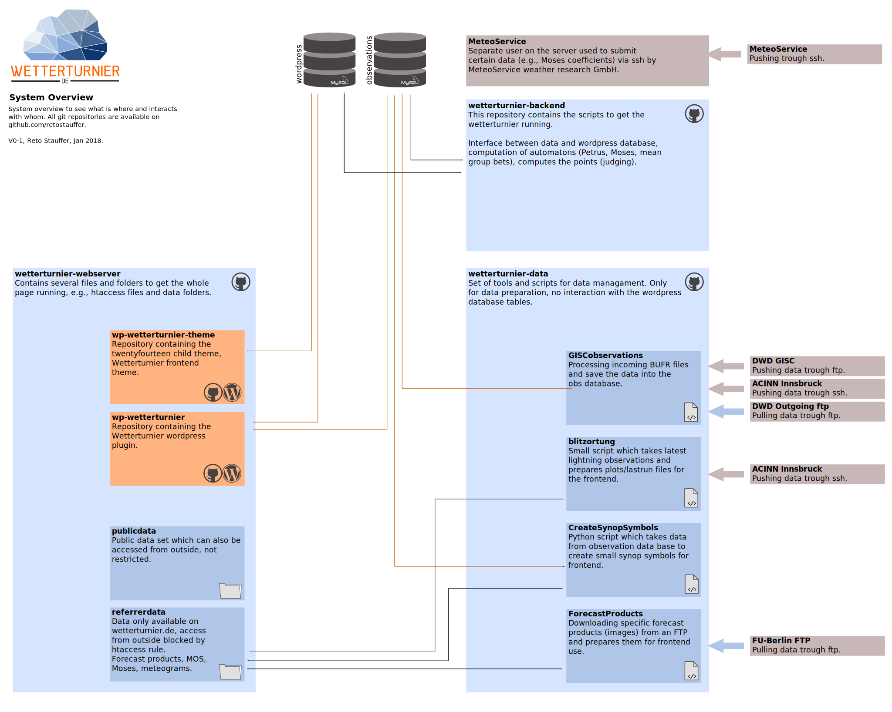

Overview
==============

This is an overvie over the whole `Wetterturnier.de <http://www.wetterturnier.de>`_
system wich consists of a set of different tools split into separate
repositories.

.. note:: You are currently looking at the documentation of the
   **wetterturnier-data** repository documentation
   (blueish box bottom right on the image below).

All parts (except data sources and logins, of course) are made publicly available
trough `<github <https://github.com/retostauffer>`_. Some links to the repositories:

* Wetterturnier Wordpress Plugin:
  `github repository <https://github.com/retostauffer/wp-wetterturnier>`_,
  `documentation on readthedocs <http://wetterturnier-wordpress-plugin.readthedocs.io/en/latest/>`_.
  As the name says: contains the wordpress plugin. Depends on the "Wetterturnier Backend"
  to get the points and rankings.
* Wetterturnier Wordpress Theme:
  `github repository <https://github.com/retostauffer/wp-wetterturnier-theme>`_,
  contains the theme used on `Wetterturnier.de <http://www.wetterturnier.de>`_,
  a Wordpress child theme based on the
  `Wordpress twentyfourteen theme <https://wordpress.org/themes/twentyfourteen/>`_.
* Wetterturnier Backend:
  `github repository <https://github.com/retostauffer/wetterturnier-backend>`_,
  `documentation on readthedocs <http://wetterturnier-backend.readthedocs.io/en/latest/>`_,
  contains the python code to compute automatons, points, and rankings.
* Wetterturnier Data Backend (the one you are currently looking at):
  `github repository  <https://github.com/retostauffer/wetterturnier-data>`_.
  Contains a set of tools to process/prepare data. Relatively specific for
  `Wetterturnier.de <http://www.wetterturnier.de>`_ but might be a starting point.
	

